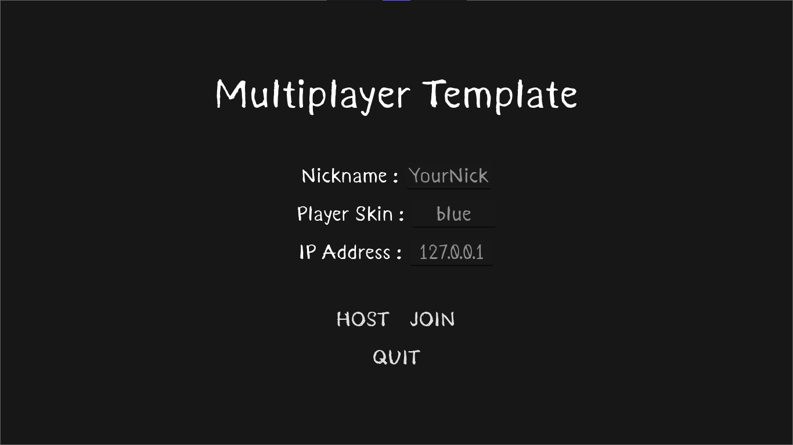
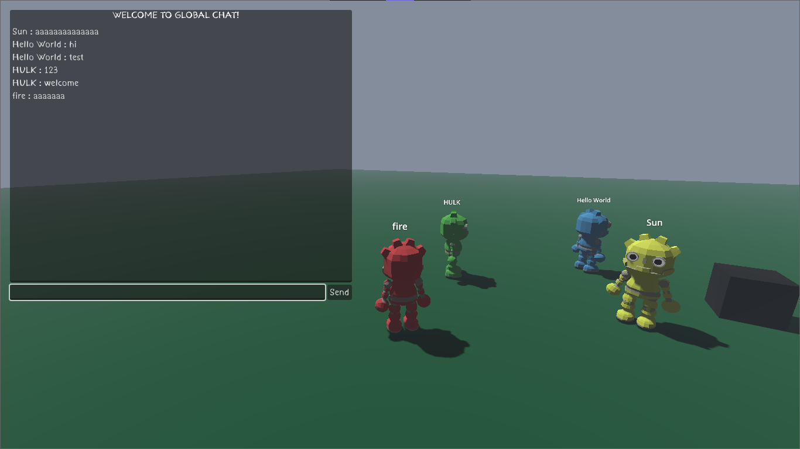

# Godot 3D Multiplayer Template

This is a foundational template for a 3D multiplayer game, developed in Godot Engine 4.4. It offers a starting structure for your next multiplayer project, including essential functionalities for players to interact and communicate in real-time.

> This template is also available on the [Godot Asset Library](https://godotengine.org/asset-library/asset/3377).

## Key Features

This template provides everything you need to kickstart your multiplayer game development:

* **Network System:** A base for managing client-server connections, allowing multiple players to connect and interact within the same environment.
* **Player Management:** Easily add multiple players to the game, controlling their interactions and movement in a 3D space.
* **Real-Time Synchronization:** Player movements and animations are smoothly synchronized, ensuring a consistent experience for everyone.
* **Player Name Displayed:** Each player's nickname is shown above their character for easy identification.
* **Player Skin Selection:** Players can choose from four skin options (red, green, blue, or yellow) to personalize their avatars.
* **Global Multiplayer Chat:** An integrated chat system allows players to communicate in real-time with everyone in the game.

## How to Run the Project

Follow these simple steps to get the template up and running:

1. **Clone or Download:** Obtain the repository by cloning it via Git or downloading the ZIP file.
2. **Open in Godot Engine:** Load the project in your [Godot Engine](https://godotengine.org) installation.
3. **Execute:** Press <kbd>F5</kbd> or click `Run Project` in the Godot editor.

 

To test the multiplayer functionality locally:
Go to `Debug` > `Customize Run Instances`, then enable `Enable Multiple Instances` and set the number of instances you want to run simultaneously. In our template, the host is not treated as an additional player.

## Controls

* <kbd>W</kbd> <kbd>A</kbd> <kbd>S</kbd> <kbd>D</kbd> to move.
* <kbd>Shift</kbd> to run.
* <kbd>Space</kbd> to jump.
* <kbd>Esc</kbd> to quit.
* <kbd>Ctrl</kbd> to hide/show chat.

## Screenshots

## Contributing

If you want to contribute to this project, please refer to our [Contributing Guidelines](CONTRIBUTING.md).

## Credits

* 3D-Godot-Robot-Platformer-Character: https://github.com/AGChow/3D-Godot-Robot-Platformer-Character (CC0)
