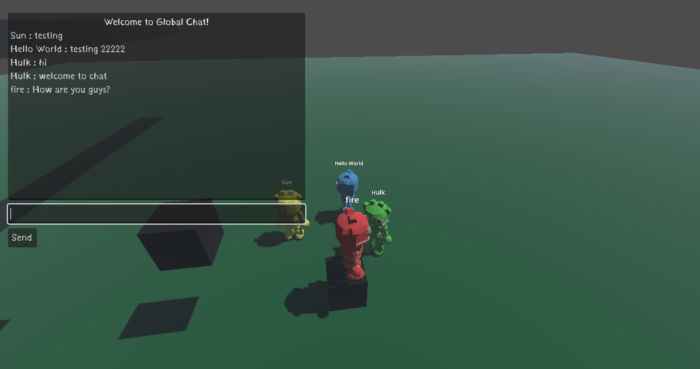

# Godot 3D Multiplayer Template

This is a template for a 3D multiplayer game developed in Godot Engine 4.3. It provides a basic structure for a multiplayer setup, where each player has a nickname displayed above their character and the option to choose from four different skins: red, green, blue, or yellow. Additionally, the template includes a global multiplayer chat system for player communication.
 
This template is also available in the [Godot Asset Library](https://godotengine.org/asset-library/asset/3377).

## How to run the project

1. Download or clone this GitHub repository.
2. Open the project in [Godot Engine](https://godotengine.org).
3. Press <kbd>F5</kbd> or `Run Project`.

 

Note: To test multiplayer locally, follow these steps:
Go to `Debug` > `Customize Run Instances`, then enable `Enable Multiple Instances` and set the number of instances to run simultaneously. In this template, the host is not treated as a player.

## What Does This Template Offer?

* **Network System:** Includes a basic system for managing client-server connections.
* **Player Setup:** The template allows for adding multiple players to the game, managing their interactions and movement within the 3D environment.
* **Real-Time Synchronization:** Player movements and animations are synchronized in real-time.
* **Player Names Displayed:** Player names are shown above their heads.
* **Player Skin Selection:** Players can now choose from four skins: red, green, blue, or yellow.
* **Global Multiplayer Chat:** A global chat system that allows players to send messages to everyone in the game.

## Controls

* <kbd>W</kbd> <kbd>A</kbd> <kbd>S</kbd> <kbd>D</kbd> to move.
* <kbd>Shift</kbd> to run.
* <kbd>Space</kbd> to jump.
* <kbd>Esc</kbd> to quit.
* <kbd>Ctrl</kbd> to hide/show chat.

## Screenshots

## Credits

* 3D-Godot-Robot-Platformer-Character - https://github.com/AGChow/3D-Godot-Robot-Platformer-Character (CC0)
