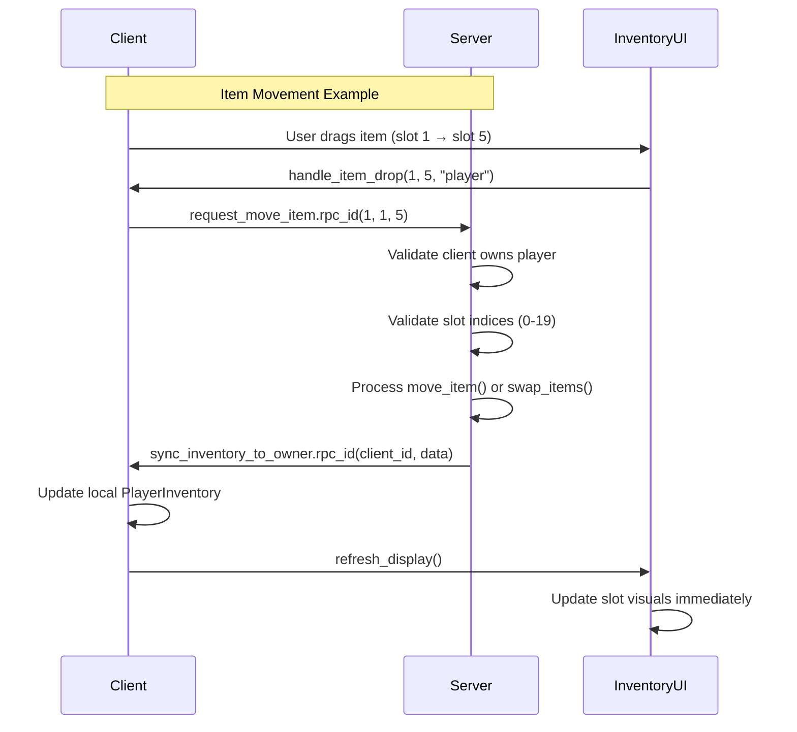

# Multiplayer Inventory System

## Overview

The inventory system is a **server-authoritative** multiplayer implementation that ensures secure, synchronized inventory management across all connected players. Each player has a private 20-slot grid-based inventory that only syncs between the server and that specific client.

## Architecture

### Core Components

- **PlayerInventory** (`scripts/player_inventory.gd`) - Core inventory logic with slot management
- **InventorySlot** (`scripts/inventory_slot.gd`) - Individual slot data and validation  
- **Item & ItemDatabase** (`scripts/item.gd`, `scripts/item_database.gd`) - Item definitions and management
- **InventoryUI** (`scripts/inventory_ui.gd`) - Client-side UI and interaction handling
- **Player Network Layer** (`level/scripts/player.gd`) - RPC methods and server validation

### Server Authority Model

- **Server**: Maintains authoritative state for all player inventories
- **Client**: Sends requests to server, receives updates, handles UI
- **Validation**: All operations validated server-side before execution
- **Privacy**: Each client only receives their own inventory data

## Client-Server Interactions

### 1. Inventory Synchronization

**Initial Sync (Client Connect)**
```
Client -> Server: request_inventory_sync()
Server -> Client: sync_inventory_to_owner(inventory_data)
Client: Updates local inventory and UI
```

### 2. Item Movement (Drag & Drop)

**Move/Swap Items**
```
Client: User drags item from slot A to slot B
Client -> Server: request_move_item(from_slot, to_slot, quantity)
Server: Validates request and ownership
Server: Processes move/swap operation  
Server -> Client: sync_inventory_to_owner(updated_inventory)
Client: UI updates immediately with new state
```

### 3. Item Addition (Pickups/Rewards)

**Add Items**
```
Server/Client -> Server: request_add_item(item_id, quantity)
Server: Validates item existence and quantity
Server: Attempts to add item to inventory
Server -> Client: sync_inventory_to_owner(updated_inventory)
Client: UI reflects new items immediately
```

### 4. Item Removal (Consumption/Drops)

**Remove Items**
```
Client -> Server: request_remove_item(item_id, quantity)
Server: Validates ownership and availability
Server: Removes items from inventory
Server -> Client: sync_inventory_to_owner(updated_inventory)
Client: UI updates to show removed items
```

## RPC Methods

### Client → Server RPCs

| Method | Parameters | Description | Validation |
|--------|------------|-------------|------------|
| `request_inventory_sync()` | None | Request full inventory sync | Client must own player |
| `request_move_item()` | `from_slot, to_slot, quantity` | Move/swap inventory items | Slot bounds, ownership |
| `request_add_item()` | `item_id, quantity` | Add items to inventory | Item exists, positive quantity |
| `request_remove_item()` | `item_id, quantity` | Remove items from inventory | Item exists, sufficient quantity |

### Server → Client RPCs

| Method | Parameters | Description | Security |
|--------|------------|-------------|-----------|
| `sync_inventory_to_owner()` | `inventory_data` | Send updated inventory state | Only to owning client |

## Data Flow



## Security Features

### Server-Side Validation
- **Ownership Verification**: Clients can only modify their own inventories
- **Slot Bounds Checking**: Prevents out-of-bounds slot access  
- **Item Existence**: Validates items exist in ItemDatabase
- **Quantity Validation**: Ensures positive quantities and sufficient availability

### Network Security
- **RPC Authority**: Only server can send inventory updates to clients
- **Request Validation**: All client requests validated before processing
- **No Cross-Client Access**: Clients cannot see or modify other players' inventories

## Usage Examples

### Opening Inventory
```gdscript
# Level.gd - Toggle inventory for local player
func toggle_inventory():
    var local_player = _get_local_player()
    if local_player:
        inventory_ui.open_inventory(local_player)
```

### Adding Items (Server-Side)
```gdscript
# Example: Player picks up item
var player = get_player_by_id(client_id)
if player:
    player.request_add_item.rpc_id(1, "health_potion", 3)
```

### Custom Item Operations
```gdscript
# Example: Consume item
func use_item(item_id: String):
    var local_player = _get_local_player()
    if local_player.get_inventory().has_item(item_id):
        local_player.request_remove_item.rpc_id(1, item_id, 1)
        # Apply item effects locally
```

## Debug Features

| Key | Action | Purpose |
|-----|---------|---------|
| `B` | Toggle inventory UI | Test inventory display |
| `F1` | Add random test item | Test item addition and sync |
| `F2` | Print inventory contents | Debug inventory state |

## Troubleshooting

### Common Issues

**UI Not Updating**
- Ensure `sync_inventory_to_owner` is being called
- Check that `update_local_inventory_display()` is connected
- Verify client is receiving RPC (check debug logs)

**Items Not Moving** 
- Check server receives `request_move_item` RPC
- Verify slot indices are within bounds (0-19)
- Confirm client owns the player node

**RPC Authority Errors**
- Ensure RPCs are configured as `"any_peer"` not `"authority"`
- Verify server validation is rejecting unauthorized requests
- Check multiplayer authority setup in `_enter_tree()`

### Debug Logging

Enable debug prints by monitoring console output:
- `"Debug: request_move_item called"` - Client request received
- `"Debug: Move successful, syncing inventory"` - Server processing
- `"Debug: sync_inventory_to_owner called"` - Client receiving update
- `"Debug: InventoryUI refresh_display called"` - UI updating

## Performance Considerations

- **Sync Frequency**: Inventory only syncs on changes, not per frame
- **Data Size**: Dictionary serialization is efficient for 20 slots
- **Network Traffic**: Only affected client receives updates (not broadcast)
- **UI Updates**: Real-time updates prevent perceived lag

## Future Extensions

- **Trade System**: Extend RPCs for player-to-player item transfers  
- **Persistence**: Add database integration for inventory saving
- **Item Categories**: Implement equipment slots vs consumable slots
- **Batch Operations**: Support multiple item operations in single RPC